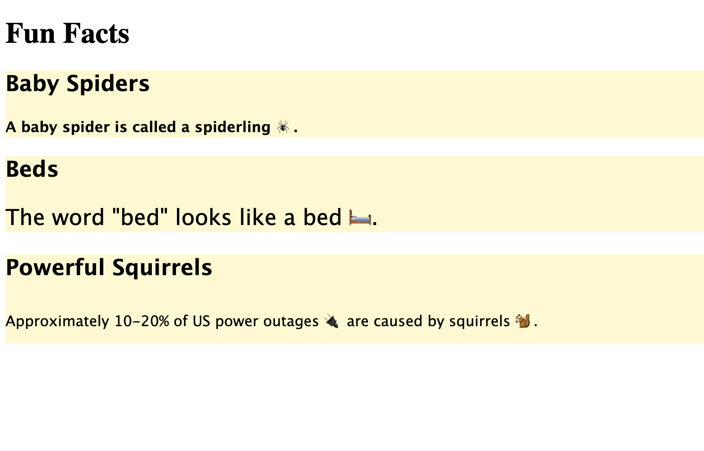

# 🐛 CSS Styling Not Applied to HTML Elements

Work with a partner to resolve the following issues:

* Users should be able to see styling applied to HTML elements when the page is opened.

## Expected Behavior

* Each section should have a background color of `#fffacd`, and the font family `"Lucida Sans Unicode", "Lucida Grande", sans-serif` should be specified.

* The `fact-1` paragraph should be bold.

* The `fact-2` paragraph should have a font size of 24px.

* The `fact-3` paragraph should have a line height of 50px.

* The finished page should match the mockup.

## Actual Behavior

When a user opens the page, no styling is visible. 

## Assets

The following image demonstrates the web application's appearance and functionality:

---

## 💡 Hints

How can you use the global attributes `id` and `class` with CSS to style elements?

To have global attribute "id" to work as css style element you'll need to go into your style.css folder then type your muliticomment line "/**/" where it explains functionality of that element of what part will be effect. After that you'll go into your next command line where you type in "." is your current directory that your in. Then type in ".section" then all your content within sections tags will be effected then add your braces "{}". Within that braces you can add any effect such as "font-;family,weight,size:" dont forgot that you need a totally of 3 different kinds of fonts for font family to change into the prefered text that is able read throughout mutplie devices and/or/add "color" what color you want your text to look like as while with "color-background" of the text. So For example you'll have something like this 
"# style.css"
/* All Sections */
.section {
    font-family: 'Verdana', 'Initial', 'Tahoma'
    color: black
    color-background: yellow
}
#fact-1 {
    front-weight:bold
}
 #fact-2{
     front-size: 36px
 }
Then you go into your index.html 
<!DOCTYPE html>
<html lang="en-us"> Language is english

  <head>
    <meta charset="UTF-8">
    <title>Example</title>
    <!-- CSS Reference -->
    <link rel="stylesheet" href="./style.css"> use these link to connect your style.css file with index.html
  </head>

  <body>
    <header>
      <h1>Lets get it into</h1>
    </header>

    <section class="section"> These where you would add your "class" so what effect would happen?
      <h2>Baby Spiders</h2>
      
Manspider a is a Villian 🕷️. 
 These where you add your "id" so what would happen?
    </section>

    <section class="section">
      <h2>What does he eat</h2>
      
Loves to eat bed-size animals 🛏️.

    </section>
</html>
So all the sections will have a font of Verdana or Initials or Tahoma with black text and yellow background
Then you have successful use a class. For your "id=fact-1" the effect would bold your text within that command line. For your "id=fact-2" your text will be enlarge of 36px.
## 🏆 Bonus

If you have completed this activity, work through the following challenge with your partner to further your knowledge:

* What are some other ways that you can use CSS properties to style text? 

What we have gotten over with so far was font-family,size,weight,color,colorbackground aswhile with custom ids. Such as font-style: normal,italic,oblique. Where you can idenifity certain text as important or not important aswhile with how fast you should read it aswhile with the tone of reading the text such as capitolization where you talk in soft voice or deep voice while reading the contents.

Use [Google](https://www.google.com) or another search engine to research this.

---

© 2021 Trilogy Education Services, LLC, a 2U, Inc. brand. Confidential and Proprietary. All Rights Reserved.
